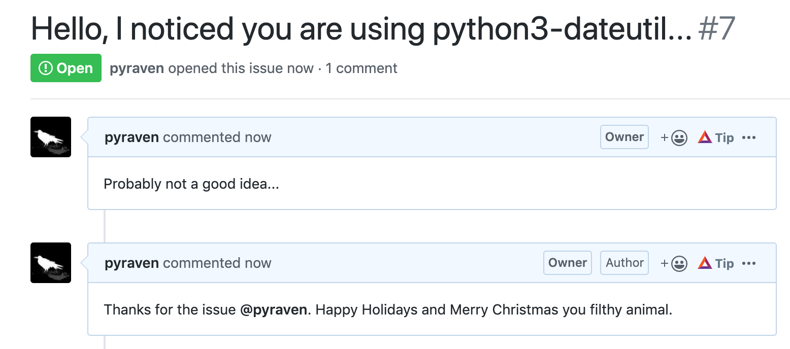

# Challenge:
We challenge you to automate creating a holiday themed "thank you" with serverless that replies to all issues created in one or more of your GitHub repositories

Solution to Day 9 of the #25DaysOfServerless. This solution uses a webhook inside a Github Repo and a Cloud Function

A user opens an issue which triggers the Cloud Function to reply with a holiday theme message. The environment variable is for an oauth token created under https://github.com/settings/developers. Under the webhook settings, I set the trigger to "Send me everything", content type = application/json, and payload URL = main.py in this repo.

Evidence:

